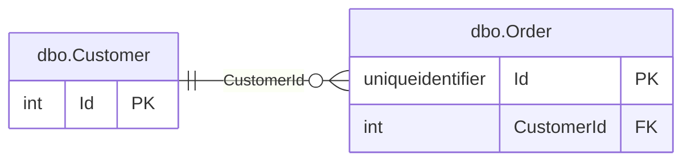
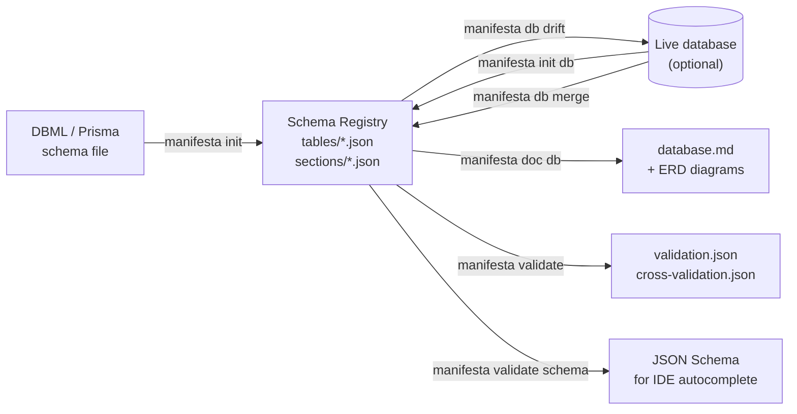

# Manifesta OSS

[](https://www.nuget.org/packages/Rujasy.Manifesta)
[](https://github.com/rujasy/manifesta/actions)
[](LICENSE)
[](https://dotnet.microsoft.com/)

> Schema documentation engine — import, validate, and generate docs from your database schema

Manifesta OSS lets you bootstrap a schema registry from an existing DBML or Prisma file, validate it against a ruleset, and generate Markdown documentation with embedded ERD diagrams — all without a live database connection.

📖 **[Documentation →](docs/documentation.md)**

---

## What it does

| Command | What it gives you |
|---------|------------------|
| `manifesta init dbml` | Bootstrap a schema registry from a `.dbml` file |
| `manifesta init prisma` | Bootstrap a schema registry from a `.prisma` schema |
| `manifesta init sql --provider mysql` | Parse a SQL DDL file (MySQL, PostgreSQL, SQLite, or SQL Server) |
| `manifesta init db --provider mysql` | Introspect a live MySQL database |
| `manifesta init db --provider postgres` | Introspect a live PostgreSQL database |
| `manifesta doc db` | Generate `database.md` with ERD diagrams and field tables |
| `manifesta doc db --format dbml` | Emit `database.dbml` for upload to dbdocs.io |
| `manifesta validate all` | Run the full per-table validation suite |
| `manifesta validate cross` | Check FK targets, section membership, and cross-entity references |
| `manifesta validate schema` | Export JSON Schema for IDE autocomplete |
| `manifesta db export --connection <cs>` | Snapshot a live database to JSON files for use with `--input-dir` |
| `manifesta db drift --connection <cs>` | Compare repo definitions against a live MySQL, PostgreSQL, or SQLite database |
| `manifesta db drift --input-dir <dir>` | Compare repo definitions against pre-exported JSON files (CI-friendly, no live connection) |
| `manifesta db drift --ddl-file <path>` | Compare repo definitions against SQL DDL files — all four dialects including SQL Server (OSS); no live connection required |
| `manifesta db merge --connection <cs>` | Pull live schema changes back into the repository JSON files |
| `manifesta db merge --input-dir <dir>` | Merge from pre-exported JSON files (air-gapped workflow) |

---

## Why Manifesta?

Most schema tools assume a live database or a hosted service. Manifesta doesn't.

| Tool | What it does well | What Manifesta adds |
|------|------------------|---------------------|
| **Prisma** | ORM schema + migrations | No ORM required; works on any SQL database; pure documentation focus |
| **Atlas** | Schema migrations + drift detection | No migration engine — just docs, validation, and registry |
| **dbdocs.io** | Hosted ERD from DBML | Offline-first, repo-sovereign, no account needed; ERDs live in your own Markdown |
| **DataGrip** | Live DB exploration | No live connection required; repeatable from source control |

**Short list of what makes Manifesta different:**

- **No live database required** — bootstrap from DBML or Prisma; introspect only when you choose to
- **Deterministic outputs** — same inputs always produce identical `database.md` and `validation.json`; safe to diff in CI
- **ERDs embedded in Markdown** — Mermaid diagrams live in your own repo, renderable on GitHub, GitLab, and Azure DevOps
- **Cross-entity validation** — FK target existence, section membership, and reference-data consistency checked in a single pass
- **Schema registry bootstrap** — one command turns an existing schema file into a structured, version-controlled JSON registry

---

## A sample output

Given a schema registry for two tables, `manifesta doc db` produces:

````markdown
**Core**


````

Followed by a field table for each entity:

| Field | Type | Nullable | Description |
|-------|------|----------|-------------|
| Id | int | | Surrogate primary key. |
| Name | varchar(255) | ✓ | Display name of the customer. |
| Email | varchar(255) | ✓ | Contact email address. |

All of this is plain Markdown that renders on GitHub, GitLab, and Azure DevOps wikis without any plugin.

---

## Installation

### Binary download — no runtime required

Manifesta ships as a **self-contained, single-file binary**. Download the binary for your platform from [GitHub Releases](https://github.com/umbrelon/manifesta/releases) and run it directly — no .NET installation, no dependencies, nothing to install first.

| Platform | File |
|----------|------|
| Linux x64 | `manifesta-linux-x64` |
| Linux ARM64 | `manifesta-linux-arm64` |
| Windows x64 | `manifesta-win-x64.exe` |
| macOS x64 | `manifesta-osx-x64` |
| macOS ARM64 | `manifesta-osx-arm64` |

```bash
# Linux / macOS
chmod +x manifesta-linux-x64
./manifesta-linux-x64 --version

# Or add it to PATH and use it as manifesta everywhere
```

### Via dotnet tool

If you already have the [.NET 10 SDK](https://dotnet.microsoft.com/) installed, you can install from NuGet instead:

```bash
dotnet tool install --global Rujasy.Manifesta
manifesta --version
```

No database connection is required for any OSS command.

---

## Quick start

```bash
# Import from DBML
manifesta init dbml --input database.dbml

# Import from Prisma
manifesta init prisma --input ./prisma/schema.prisma

# Import from a SQL DDL file (all four dialects, no live connection required)
manifesta init sql --input schema.sql --provider mysql
manifesta init sql --input tables.sql --provider sqlserver  # SQL Server supported here

# Generate documentation
manifesta doc db --output-dir ./docs

# Validate
manifesta validate all --strict
manifesta validate cross
```

See [Common Workflows](docs/workflows.md) for step-by-step guides including CI setup and dbdocs.io migration.

---

## Building from source

For contributors — not required to use Manifesta:

```bash
dotnet build
dotnet test
```

To produce a self-contained single-file binary locally, pass a runtime identifier:

```bash
# Linux x64
dotnet publish src/Manifesta.Cli -r linux-x64 -c Release

# macOS ARM64
dotnet publish src/Manifesta.Cli -r osx-arm64 -c Release

# Windows x64
dotnet publish src/Manifesta.Cli -r win-x64 -c Release
```

The solution builds on Linux, Windows, and macOS.

---

## Philosophy

Manifesta is built on five principles that inform every design decision:

**Determinism** — identical inputs always produce identical outputs. No timestamps embedded in content, no non-deterministic ordering, no surprise diffs in code review.

**Human-readable artifacts** — `database.md`, `validation.json`, and the schema registry files are all plain text. They diff cleanly, review cleanly, and need no special tooling to read.

**Zero magic** — nothing is inferred silently. Every FK, every section membership, every reference-data row is explicit in the registry. When something is missing, the validator tells you exactly what and where.

**Schema as source of truth** — the registry in your repository is the authoritative record of your data model. Live databases are an input to bootstrap it, not a dependency to run it.

**CI-friendly** — every command exits with a non-zero code on validation failure, writes machine-readable JSON, and produces no interactive output. Drop it into any pipeline.

---

## Architecture



The schema registry is the hub. `init` and `db merge` write to it; `doc`, `validate`, and `db drift` read from it.

---

## Documentation

- [Example Registry](docs/example-registry.md) — complete two-table registry with section, ERD, and generated output
- [Common Workflows](docs/workflows.md) — first-time setup, CI validation, docs regeneration, dbdocs.io migration
- [Configuration Reference](docs/config.md) — all `manifesta.config.json` properties
- [table.json / section.json Reference](docs/table-json-reference.md) — complete field-level property reference
- [Init Commands](docs/commands-init.md) — `init dbml`, `init prisma`, `init db`
- [Doc Command](docs/commands-doc.md) — `doc db`
- [DB Commands](docs/commands-db.md) — `db drift`, `db merge`
- [Validate Commands](docs/commands-validate.md) — `validate schema`, `validate all`, `validate cross`
- [Schema Features](docs/schema-features.md) — table.json format, FK kinds, sections, ERDs

---

## License

MIT — Copyright (c) 2026 RUJASY VOF
