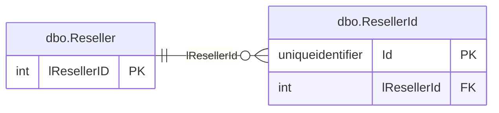
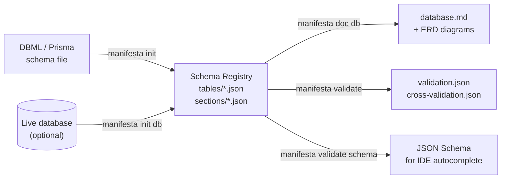

# Manifesta OSS

> Schema documentation engine — import, validate, and generate docs from your database schema

Manifesta OSS lets you bootstrap a schema registry from an existing DBML or Prisma file, validate it against a ruleset, and generate Markdown documentation with embedded ERD diagrams — all without a live database connection.

📖 **[Documentation →](docs/documentation.md)**

---

## What it does

| Command | What it gives you |
|---------|------------------|
| `manifesta init dbml` | Bootstrap a schema registry from a `.dbml` file |
| `manifesta init prisma` | Bootstrap a schema registry from a `.prisma` schema |
| `manifesta init db --provider mysql` | Introspect a live MySQL database |
| `manifesta init db --provider postgres` | Introspect a live PostgreSQL database |
| `manifesta doc db` | Generate `database.md` with ERD diagrams and field tables |
| `manifesta doc db --format dbml` | Emit `database.dbml` for upload to dbdocs.io |
| `manifesta validate all` | Run the full per-table validation suite |
| `manifesta validate cross` | Check FK targets, section membership, and cross-entity references |
| `manifesta validate schema` | Export JSON Schema for IDE autocomplete |

---

## Why Manifesta?

Most schema tools assume a live database or a hosted service. Manifesta doesn't.

| Tool | What it does well | What Manifesta adds |
|------|------------------|---------------------|
| **Prisma** | ORM schema + migrations | No ORM required; works on any SQL database; pure documentation focus |
| **Atlas** | Schema migrations + drift detection | No migration engine — just docs, validation, and registry |
| **dbdocs.io** | Hosted ERD from DBML | Offline-first, repo-sovereign, no account needed; ERDs live in your own Markdown |
| **DataGrip** | Live DB exploration | No live connection required; repeatable from source control |

**Short list of what makes Manifesta different:**

- **No live database required** — bootstrap from DBML or Prisma; introspect only when you choose to
- **Deterministic outputs** — same inputs always produce identical `database.md` and `validation.json`; safe to diff in CI
- **ERDs embedded in Markdown** — Mermaid diagrams live in your own repo, renderable on GitHub, GitLab, and Azure DevOps
- **Cross-entity validation** — FK target existence, section membership, and reference-data consistency checked in a single pass
- **Schema registry bootstrap** — one command turns an existing schema file into a structured, version-controlled JSON registry

---

## A sample output

Given a schema registry for two tables, `manifesta doc db` produces:

````markdown
**Core identity**


````

Followed by a field table for each entity:

| Field | Type | Nullable | Description |
|-------|------|----------|-------------|
| lResellerID | int | | The ID of the reseller (unique). |
| szName | varchar(255) | ✓ | The display name of the reseller. |
| lParentID | int | ✓ | Parent reseller ID — self-referencing hierarchy. |

All of this is plain Markdown that renders on GitHub, GitLab, and Azure DevOps wikis without any plugin.

---

## Full edition

The full (closed-source) edition of Manifesta adds:

- **Live database introspection** — SQL Server, MySQL, PostgreSQL via `init db`, `db export`, `db merge`, `db drift`
- **API validation and documentation** — OpenAPI 3.x parsing, validation, Swagger UI generation
- **AI description generation** — Auto-generate field and table descriptions via `ai describe`; discover missing FK relationships via `ai infer`
- **Manifest generation** — Produce dependency-ordered manifests for data pipelines
- **Multi-tenant drift analysis** — Compare schema definitions across tenant databases

---

## Quick start

**Import from DBML:**

```bash
manifesta init dbml --input database.dbml
```

This writes one `table.json` per table to `./tables/` and one `section.json` per `TableGroup` to `./document-sections/`.

**Import from Prisma:**

```bash
manifesta init prisma --input ./prisma/schema.prisma
```

SQL types, primary keys, foreign keys, and native type overrides are inferred automatically from the `datasource` block.

**Generate documentation:**

```bash
manifesta doc db --output-dir ./docs
```

Produces `database.md` with a hierarchical table of contents, per-table field listings, and embedded Mermaid ERD diagrams.

**Validate:**

```bash
manifesta validate all --strict
```

Runs the full validation suite — PK/FK rules, reference data consistency, computed field correctness — and writes `validation.json`.

---

## Requirements

- [.NET 10 SDK](https://dotnet.microsoft.com/) or later

No database connection required for OSS commands.

---

## Building from source

```bash
dotnet build
dotnet test
```

The solution builds on Linux, Windows, and macOS.

---

## Philosophy

Manifesta is built on five principles that inform every design decision:

**Determinism** — identical inputs always produce identical outputs. No timestamps embedded in content, no non-deterministic ordering, no surprise diffs in code review.

**Human-readable artifacts** — `database.md`, `validation.json`, and the schema registry files are all plain text. They diff cleanly, review cleanly, and need no special tooling to read.

**Zero magic** — nothing is inferred silently. Every FK, every section membership, every reference-data row is explicit in the registry. When something is missing, the validator tells you exactly what and where.

**Schema as source of truth** — the registry in your repository is the authoritative record of your data model. Live databases are an input to bootstrap it, not a dependency to run it.

**CI-friendly** — every command exits with a non-zero code on validation failure, writes machine-readable JSON, and produces no interactive output. Drop it into any pipeline.

---

## Architecture



The schema registry is the hub. The init commands populate it; the doc and validate commands read from it. No command writes to the registry except `init`.

---

## Roadmap

See [CHANGELOG.md](CHANGELOG.md) for what is already shipped.

Planned for upcoming releases:

- `init openapi` — bootstrap an API registry from an OpenAPI 3.x spec
- `doc api` — generate API documentation with Swagger UI
- `validate drift` — compare the registry against a live database and report schema drift
- `ai describe` (OSS tier) — generate field and table descriptions via the Claude API

---

## Documentation

- [Example Registry](docs/example-registry.md) — complete two-table registry with section, ERD, and generated output
- [Common Workflows](docs/workflows.md) — first-time setup, CI validation, docs regeneration, dbdocs.io migration
- [Init Commands](docs/commands-init.md) — `init dbml`, `init prisma`
- [Doc Command](docs/commands-doc.md) — `doc db`
- [Validate Commands](docs/commands-validate.md) — `validate schema`, `validate all`, `validate cross`
- [Schema Features](docs/schema-features.md) — table.json format, FK kinds, sections, ERDs

---

## License

MIT — Copyright (c) 2026 RUJASY VOF
