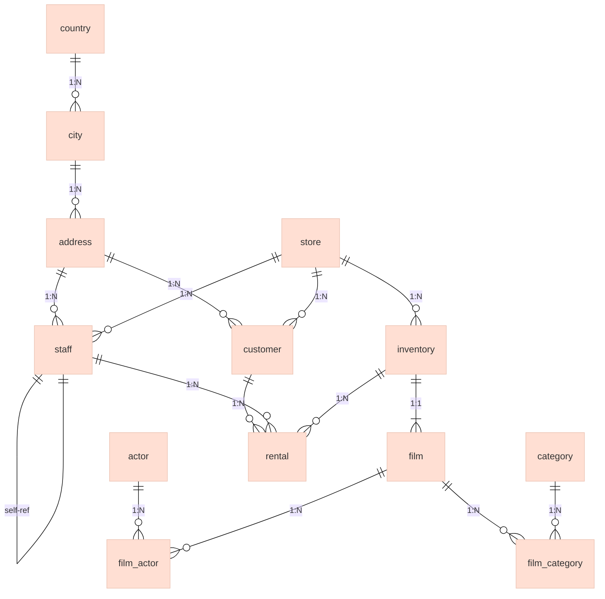
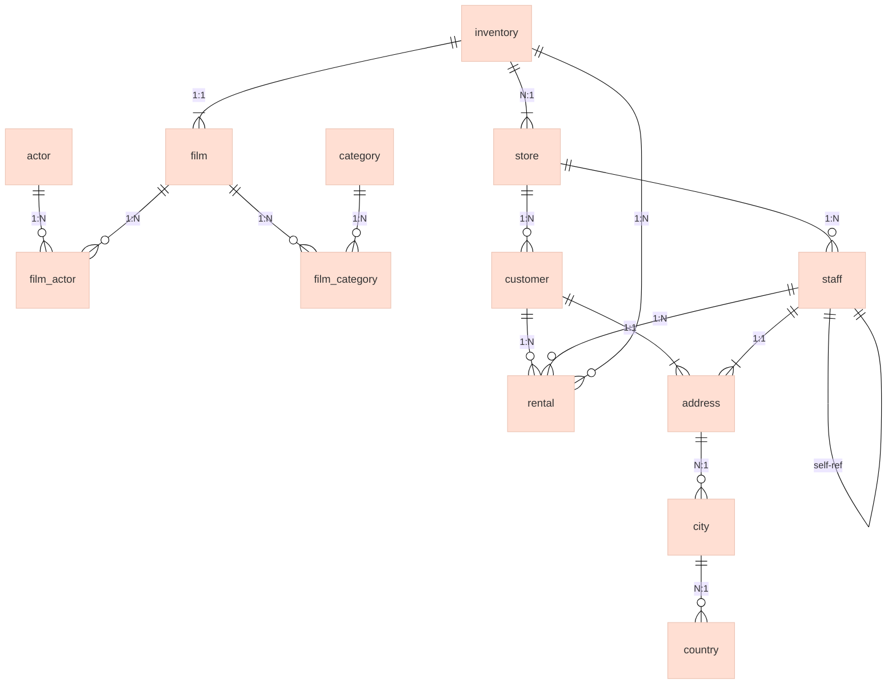

# Getting Started with Manifesta: Taming Complex Database Schemas

Testing a database tool on a `users` table with three columns is like judging a car by how well it drives in an empty parking lot. **Real databases have dozens of tables, circular dependencies, and legacy constraints**—and that's where Manifesta shines.

In this guide, we'll **throw Sakila's 16-table, deeply relational schema** at Manifesta and show how it handles foreign keys, composite constraints, and recursive relationships **without breaking a sweat**. By the end, you'll see why Manifesta isn't just another schema tool—it's built for **real-world complexity**.

---

## Why Sakila?

Sakila is MySQL's sample database, designed to model a **DVD rental store**. It's the perfect test case because it includes:

- ✅ **16 tables** with realistic relationships (1:1, 1:N, M:N).
- ✅ **Complex constraints**: Composite primary keys, `ENUM` types, `TIMESTAMP` defaults.
- ✅ **Self-referencing tables** (e.g., `staff` reports to `staff`).
- ✅ **Junction tables** (`film_actor`, `film_category`) for many-to-many relationships.
- ✅ **Widely recognized**—most developers have seen it, so it's easy to verify results.

If Manifesta can handle Sakila, it can handle **your schema**.

---

## Step 1: Spin Up the Test Schema

Sakila is just a SQL dump away. Here's how to get it running in **under 2 minutes**:

### Option A: Local MySQL

```bash
# Download Sakila schema
curl -O https://raw.githubusercontent.com/jOOQ/jOOQ/main/jOOQ-examples/Sakila/src/main/java/org/jooq/test/sakila/db/mysql/sakila-schema.sql

# Create database and import
mysql -u root -p -e "CREATE DATABASE IF NOT EXISTS manifesta_test;"
mysql -u root -p manifesta_test < sakila-schema.sql
```

### Option B: Docker (No Local MySQL Required)

```bash
# Spin up MySQL and import Sakila in one go
docker run --name sakila -e MYSQL_ROOT_PASSWORD=password -p 3306:3306 -d mysql:8.0
sleep 10  # Wait for MySQL to start
docker exec -i sakila mysql -uroot -ppassword < <(curl -s https://raw.githubusercontent.com/jOOQ/jOOQ/main/jOOQ-examples/Sakila/src/main/java/org/jooq/test/sakila/db/mysql/sakila-schema.sql)
```

**Verify it worked:**

```bash
mysql -u root -p -e "USE manifesta_test; SHOW TABLES;"
# Expected: 16 tables (actor, address, category, city, country, ...)
```

---

## Step 2: Install Manifesta

Manifesta is a **self-contained .NET binary**. Build it from source or grab a pre-built release.

### Clone and Build

```bash
git clone https://github.com/your-org/manifesta.git
cd manifesta

# Build from source (requires .NET 10 SDK)
dotnet build src/Manifesta.Cli -c Release

# Find the binary (adjust path for your OS)
MANIFESTA=./src/Manifesta.Cli/bin/Release/net10.0/linux-x64/publish/manifesta
chmod +x $MANIFESTA

# Verify installation
$MANIFESTA --version
# Expected: Manifesta OSS vX.Y.Z
```

### Pre-Built Binaries (No .NET Required)

Grab a pre-built binary from the releases page—no SDK required.

---

## Step 3: Unleash Manifesta on Sakila

Now for the fun part—let's see how Manifesta handles Sakila's complexity.

---

### 🔹 Feature 1: Introspect Complex Schemas

**Command:**

```bash
$MANIFESTA init db \
  --connection "Server=localhost;Database=manifesta_test;Uid=root;Pwd=password;" \
  --provider mysql \
  --output-dir ./sakila-registry
```

**What Happens:**
Manifesta connects to your Sakila database and **reverse-engineers the entire schema** into a structured registry. Each table gets its own JSON file in `./sakila-registry/tables/`, views go to `./sakila-registry/views/`, and a config file is written to `./sakila-registry/_/manifesta.config.json`.

> **Note:** The `--provider mysql` flag is required. Manifesta supports SQL Server, MySQL, and PostgreSQL; the provider defaults to `sqlserver` when omitted.

**Expected output:**

```
Successfully initialized with 16 table(s) in ./sakila-registry
```

**Peek at the Registry:**

```bash
ls ./sakila-registry/tables/
# actor.json  address.json  category.json  city.json  country.json  ...  (16 files)

cat ./sakila-registry/tables/film.json
```

**Example: `film.json`**

```json
{
  "name": "film",
  "description": null,
  "columns": [
    { "name": "film_id",      "type": "smallint",                        "primaryKey": true, "autoIncrement": true },
    { "name": "title",        "type": "varchar(255)",                    "nullable": false },
    { "name": "description",  "type": "text" },
    { "name": "release_year", "type": "year" },
    { "name": "rating",       "type": "enum('G','PG','PG-13','R','NC-17')" },
    { "name": "last_update",  "type": "timestamp", "default": "CURRENT_TIMESTAMP" }
  ],
  "foreignKeys": [],
  "indexes": [
    { "name": "idx_title", "columns": ["title"] }
  ]
}
```

**Why This Is Impressive:**

- **Handles `ENUM` types** (MySQL-specific) without breaking.
- **Preserves defaults** (e.g., `CURRENT_TIMESTAMP` for `last_update`).
- **Detects indexes** (e.g., `idx_title` on the `title` column).

The generated `_/manifesta.config.json` is the anchor for all subsequent commands—it records the root path and which directories to skip:

```json
{
  "paths": {
    "root": "../",
    "skip": ["_"]
  }
}
```

---

### 🔹 Feature 2: Cross-Validate Entity References

Sakila has **28 foreign keys**, including circular references (e.g., `staff.manager_staff_id` points to `staff.staff_id`). `validate cross` checks all FK targets, section memberships, and API-to-table references across the entire registry.

**Command** (run from within `./sakila-registry`):

```bash
$MANIFESTA validate cross --output-dir ./_/reports/
```

> **Tip:** Always write validation output inside `_/` (or another subdirectory). Files placed in the registry root are picked up by the table loader and will cause an error on subsequent commands.

**Expected output:**

```
Wrote cross-validation.json: 0 error(s), 0 warning(s) — ./_/reports/cross-validation.json
```

**Example: `_/reports/cross-validation.json`**

```json
{
  "tablesScanned": 16,
  "sectionsScanned": 1,
  "apisScanned": 0,
  "errors": [],
  "warnings": []
}
```

**Why This Is Impressive:**

- **Catches broken FKs**: If a foreign key points to a non-existent table or column, Manifesta flags it here with a structured error.
- **Handles self-references**: The `staff` table's circular reference is validated correctly.
- **M:N relationships**: Junction tables like `film_actor` are verified as valid.

---

### 🔹 Feature 3: Generate Documentation with ERDs

Manifesta **auto-generates Markdown documentation** with embedded ERD diagrams. This is a game-changer for onboarding and audits.

**Command** (run from within `./sakila-registry`):

```bash
$MANIFESTA doc db --output-dir ./sakila-docs
```

**Expected output:**

```
Generated database.md with 16 tables at ./sakila-docs/database.md
```

The command reads from the registry and produces a single Markdown file with:

- A **Mermaid ERD** that renders natively on GitHub and GitLab.
- **Field tables** for every table (types, nullability, defaults).
- **Cross-reference links** between related tables.

**Preview: ERD Section**



**Preview: Field Table for `film`**

| Field        | Type                               | Nullable | Default           |
| ------------ | ---------------------------------- | :------: | ----------------- |
| film_id      | smallint                           |          |                   |
| title        | varchar(255)                       | ✗        |                   |
| description  | text                               | ✓        |                   |
| release_year | year                               | ✓        |                   |
| rating       | enum('G','PG','PG-13','R','NC-17') | ✗        |                   |
| last_update  | timestamp                          | ✗        | CURRENT_TIMESTAMP |

**Why This Is Impressive:**

- **Zero manual work**: The ERD and field tables are generated automatically from the registry.
- **GitHub-friendly**: Mermaid diagrams render natively in GitHub/GitLab.
- **Always up-to-date**: Regenerate docs whenever the schema changes.

---

### 🔹 Feature 4: Drift Detection Against a Live DB

Let's verify that Manifesta's registry **exactly matches** the live Sakila database.

**Command** (run from within `./sakila-registry`):

```bash
$MANIFESTA db drift \
  --connection "Server=localhost;Database=manifesta_test;Uid=root;Pwd=password;" \
  --provider mysql \
  --output-dir ./_/reports/
```

**Expected output:**

```
No drift detected — 23 table(s) in sync.
```

The count is 23 because Manifesta tracks both the 16 base tables and the 7 views that Sakila ships. Manifesta writes a full Markdown report to `_/reports/drift-report.md` regardless of whether drift is found. The exit code is `0` (in sync) or `1` (drift detected), making it easy to gate CI pipelines.

**Try It: Simulate Drift**

To see drift detection in action, manually alter the database and re-run:

```bash
# Add a column directly to the DB (bypassing Manifesta)
mysql -u root -p -e "USE manifesta_test; ALTER TABLE actor ADD COLUMN test_column VARCHAR(255);"

# Re-run drift detection
$MANIFESTA db drift \
  --connection "Server=localhost;Database=manifesta_test;Uid=root;Pwd=password;" \
  --provider mysql \
  --output-dir ./_/reports/
```

**Expected output:**

```
Drift detected — 1 table(s) drifted, 0 absent from source. See _/reports/drift-report.md.
```

The generated `drift-report.md` contains a structured breakdown per table, with exactly which columns, indexes, or FK relationships changed.

---

### 🔹 Feature 5: JSON Schema for IDE Validation

Manifesta stores your schema as plain JSON files and ships a command to extract **JSON Schemas** for those files. This enables your IDE to validate and autocomplete registry files as you edit them.

**Command:**

```bash
$MANIFESTA validate schema table --output-dir ./_/schemas/
```

**Expected output:**

```
Generated table-schema.json at ./_/schemas/table-schema.json
```

Point your IDE or the `$schema` key in your table files at this schema to get full validation and autocomplete. Additional schemas are available for section definitions, API definitions, and the Manifesta config file itself:

```bash
$MANIFESTA validate schema section --output-dir ./_/schemas/
$MANIFESTA validate schema api     --output-dir ./_/schemas/
$MANIFESTA validate schema config  --output-dir ./_/schemas/
```

---

## Step 4: Verification & Next Steps

### ✅ Verification Checklist

| **Command**                     | **Output**                      | **Expected Result**                              |
| ------------------------------- | ------------------------------- | ------------------------------------------------ |
| `init db`                       | `tables/*.json`                 | 16 JSON files, 1 per table                       |
| `validate cross`                | `_/reports/cross-validation.json` | 0 errors, 0 warnings                           |
| `doc db`                        | `sakila-docs/database.md`       | Mermaid ERD + field tables                       |
| `db drift`                      | `_/reports/drift-report.md`     | "No drift detected — 23 table(s) in sync."       |
| `validate schema table`         | `_/schemas/table-schema.json`   | JSON Schema for Manifesta registry files         |

### 🚀 Next Steps

1. **Try it on your own schema**:

   ```bash
   $MANIFESTA init db \
     --connection "Server=your-db;Database=your-schema;..." \
     --provider sqlserver \
     --output-dir ./my-registry
   ```

2. **Integrate into CI**:
   - Add `manifesta validate all` to your pipeline to **block invalid registry files**.
   - Add `manifesta validate cross` to **catch broken FK references** before they reach production.
   - Use `manifesta db drift` to **compare your registry against a live environment**.

3. **Explore More**:
   - [Sakila Schema Reference](https://dev.mysql.com/doc/sakila/en/)

---

## Visual Recap: Sakila's Schema

Here's what we tackled—**16 tables, 28 foreign keys, and 1 self-reference**:



**Key Relationships:**

- **M:N**: `film_actor` (films ↔ actors), `film_category` (films ↔ categories).
- **1:N**: `customer` → `rental`, `film` → `inventory`.
- **Self-reference**: `staff` → `staff` (manager hierarchy).

---

## Final Thoughts

Manifesta didn't just **survive** Sakila—it **thrived**. It handled:

- ✅ **Complex constraints** (ENUMs, composites, defaults).
- ✅ **Circular references** (self-referencing tables).
- ✅ **Junction tables** (M:N relationships).
- ✅ **Cross-entity validation** (28 FKs, all verified).
- ✅ **Documentation generation** (ERDs + field tables).

If Manifesta can tame Sakila, it can tame **your schema**.

---

*This guide uses Sakila, MySQL's sample database. For other databases (PostgreSQL, SQL Server), Manifesta supports the same workflows—just change the connection string and `--provider` flag.*
