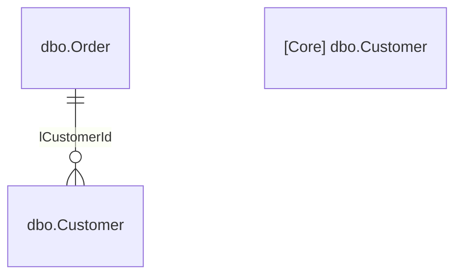

# Manifesta — Documentation Commands

← [Back to documentation](./documentation.md)

---

## Table of Contents

- [Doc DB](#doc-db)

---

## Doc DB

Generates documentation from the schema registry. Defaults to Markdown; pass `--format dbml` to emit a DBML file for direct upload to dbdocs.io.

```bash
# Generate Markdown documentation (default)
manifesta doc db

# Write to a specific directory
manifesta doc db --output-dir ./publish

# Generate a DBML file for dbdocs.io
manifesta doc db --format dbml

# Override the output file path
manifesta doc db --format dbml --output ./docs/schema.dbml
```

**Flags:**

| Flag | Default | Description |
|------|---------|-------------|
| `--format` | `markdown` | Output format: `markdown` (generates `database.md`) or `dbml` (generates `database.dbml`) |
| `--output` | — | Override the default output file path |
| `--output-dir` | `.` | Output directory (default filename depends on `--format`) |
| `--no-logical` | false | Exclude logical FKs from ERD diagrams (Markdown only) |
| `--include-virtual` | false | Include virtual FKs in ERD diagrams (Markdown only) |

**Output files:**

| `--format` | Default output file | Description |
|------------|--------------------|-|
| `markdown` | `database.md` | Full schema documentation with ERD diagrams, FK listings, and table/column descriptions |
| `dbml` | `database.dbml` | DBML schema for direct push to dbdocs.io |

---

### Markdown output

The generated `database.md` contains:

- A hierarchical **Table of Contents** with anchor links. When a table has a `shortDescription`, it is shown as a suffix on the TOC entry:
  ```markdown
  - [dbo.Order](#dbo-order) - Customer purchase order headers
  ```
- A **section heading** per `SectionDefinition`, with a description block and one or more embedded Mermaid ERD diagrams
- A **table block** per `TableDefinition` with:
  - Description paragraph
  - Fields table: Name, Type, Nullable, PK, FK, Description columns
  - FK annotations with kind labels: `(logical)`, `(virtual)`, `(cascades)`
  - Computed field marker: `ƒ` symbol with expression in a code span

**Azure DevOps wikis:** Set `"format": { "type": "markdown", "dialect": "AzureDevOps" }` in `manifesta.config.json` under `"output"` to switch the Mermaid fence syntax from ` ```mermaid ``` ` to `:::mermaid` / `:::`, which Azure DevOps requires for inline rendering.

```json
{
  "output": {
    "type": "markdown",
    "dialect": "AzureDevOps"
  }
}
```

---

### DBML output

DBML output is deterministic and round-trips cleanly through `init dbml`: all field types, constraints, descriptions, FK kinds, and computed column properties survive a generate → parse cycle without loss.

| IR concept | DBML output |
|------------|-------------|
| `TableDefinition` | `Table` block |
| `FieldDefinition.IsPrimaryKey` | `[pk]` constraint |
| `FieldDefinition.Nullable = false` | `[not null]` constraint |
| `FieldDefinition.Description` | `[note: "..."]` inline note |
| `TableDefinition.Description` | `Note: "..."` inside table block |
| `ForeignKey` (physical) | `Ref: A.col > B.col` |
| `ForeignKey` (logical) | `Ref: A.col > B.col // logical` |
| `ForeignKey` (virtual) | `Ref: A.col > B.col // virtual` |
| `SectionDefinition` | `TableGroup` block |
| Computed column | `[note: "// calculated: ([expr]) PERSISTED"]` inline note |

**Workflow with dbdocs.io:**

```bash
# Generate DBML
manifesta doc db --format dbml --output ./schema.dbml

# Push to dbdocs.io (requires dbdocs CLI)
dbdocs build ./schema.dbml
```

---

### Section ordering

By default, sections appear in the order they are loaded (sorted by file path). Set `sectionOrder` in `manifesta.config.json` to control the order explicitly:

```json
{
  "output": {
    "sectionOrder": ["Core", "Orders", "Reference"]
  }
}
```

Sections not listed in `sectionOrder` are appended after the listed ones in alphabetical order.

---

### Cross-section FK stubs

Physical FK references that cross section boundaries are rendered as external stubs in ERD diagrams:



Pass `--no-cross-section` to suppress these stubs and render only intra-section relationships.
