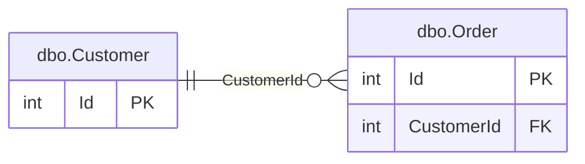

# Manifesta — Example Registry

← [Back to documentation](./documentation.md)

---

A complete minimal registry: two tables with a foreign key, one section with an ERD, and the documentation it produces.

## Directory structure

```
tables/
  dbo.Customer.json
  dbo.Order.json
document-sections/
  Core.json
manifesta.config.json
```

---

## tables/dbo.Customer.json

```json
{
  "name": "dbo.Customer",
  "description": "Registered customers. Each row represents one customer account.",
  "shortDescription": "Customer accounts",
  "labelField": "Name",
  "fields": [
    {
      "name": "Id",
      "type": "int",
      "nullable": false,
      "isPrimaryKey": true,
      "description": "Surrogate primary key."
    },
    {
      "name": "Name",
      "type": "nvarchar(100)",
      "nullable": false,
      "description": "Display name of the customer."
    },
    {
      "name": "Email",
      "type": "varchar(255)",
      "nullable": false,
      "sensitivity": "PII",
      "description": "Primary contact email address."
    },
    {
      "name": "CreatedAt",
      "type": "datetime2",
      "nullable": false,
      "description": "UTC timestamp of account creation."
    }
  ],
  "primaryKey": ["Id"]
}
```

---

## tables/dbo.Order.json

```json
{
  "name": "dbo.Order",
  "description": "Customer purchase orders. Each row is a single order header; line items are in dbo.OrderLine.",
  "shortDescription": "Customer purchase order headers",
  "fields": [
    {
      "name": "Id",
      "type": "int",
      "nullable": false,
      "isPrimaryKey": true,
      "description": "Surrogate primary key."
    },
    {
      "name": "CustomerId",
      "type": "int",
      "nullable": false,
      "description": "The customer who placed this order."
    },
    {
      "name": "PlacedAt",
      "type": "datetime2",
      "nullable": false,
      "description": "UTC timestamp when the order was placed."
    },
    {
      "name": "Total",
      "type": "decimal(10,2)",
      "nullable": false,
      "description": "Order total in the customer's billing currency."
    }
  ],
  "primaryKey": ["Id"],
  "foreignKeys": [
    {
      "sourceField": "CustomerId",
      "targetTable": "dbo.Customer",
      "targetField": "Id"
    }
  ]
}
```

---

## document-sections/Core.json

```json
{
  "name": "Core",
  "description": "Core business entities — customers and their orders.",
  "tables": ["dbo.Customer", "dbo.Order"],
  "erds": [
    {
      "title": "Core entities",
      "fields": "pk-and-fk"
    }
  ]
}
```

---

## manifesta.config.json

Minimal config — all paths at their defaults.

```json
{
  "paths": {
    "tables": "./tables",
    "sections": "./document-sections"
  },
  "output": {
    "path": "./publish/database.md"
  }
}
```

---

## Running the commands

```bash
# Generate database.md
manifesta doc db

# Validate per-table rules
manifesta validate all

# Validate cross-entity references (FK targets, section membership)
manifesta validate cross
```

---

## What manifesta doc db produces

````markdown
# DATABASE

> Generated by Manifesta on 2026-05-24 20:00:00 UTC

## Table of Contents

- [Core](#core)
  - [dbo.Customer](#dbo-customer) - Customer accounts
  - [dbo.Order](#dbo-order) - Customer purchase order headers

---

## Core

Core business entities — customers and their orders.

**Core entities**



### dbo.Customer

- Registered customers. Each row represents one customer account.

| Field | Type | Nullable | Sensitivity | Description |
|-------|------|----------|-------------|-------------|
| Id | int | | | Surrogate primary key. |
| Name | nvarchar(100) | | | Display name of the customer. |
| Email | varchar(255) | | 🔴 PII | Primary contact email address. |
| CreatedAt | datetime2 | | | UTC timestamp of account creation. |

**Foreign keys:** none

### dbo.Order

- Customer purchase orders. Each row is a single order header; line items are in dbo.OrderLine.

| Field | Type | Nullable | Description |
|-------|------|----------|-------------|
| Id | int | | Surrogate primary key. |
| CustomerId | int | | The customer who placed this order. |
| PlacedAt | datetime2 | | UTC timestamp when the order was placed. |
| Total | decimal(10,2) | | Order total in the customer's billing currency. |

**Foreign keys:**
- `CustomerId` → `dbo.Customer.Id`
````
