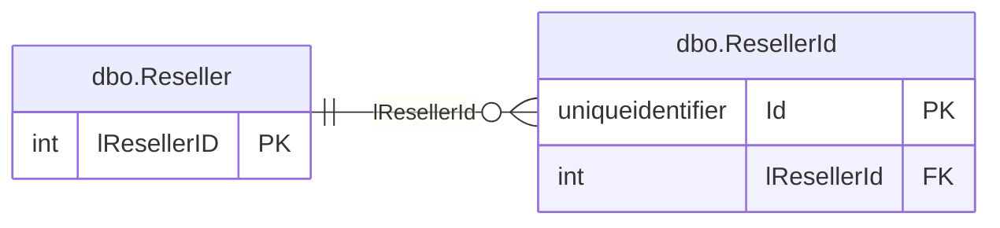

# Manifesta — Schema Features

← [Back to documentation](./documentation.md)

---

## Table of Contents

- [Table Descriptions](#table-descriptions)
- [Reference Tables](#reference-tables)
- [Computed Fields](#computed-fields)
- [Configuring Foreign Keys in table.json](#configuring-foreign-keys-in-tablejson)
- [Configuring ERD Diagrams in section.json](#configuring-erd-diagrams-in-sectionjson)
- [Deprecation and Sensitivity](#deprecation-and-sensitivity)

---

## Table Descriptions

Each table in the schema registry supports two description fields. Both are repo-sovereign and are never modified by automated tooling.

| Property | Type | Description |
|----------|------|-------------|
| `description` | string | Full multi-sentence description of the table's purpose and scope. Rendered as a bullet point below the table heading in `database.md`. |
| `shortDescription` | string | One-liner (≤15 words) shown next to the table name in the Table of Contents of `database.md`. Omitted from JSON when empty. |

### Example

```json
{
  "name": "dbo.Order",
  "description": "Stores customer purchase orders. Each row represents a single order header; line items are stored in dbo.OrderLine. Deleted orders are soft-deleted via the IsDeleted flag.",
  "shortDescription": "Customer purchase order headers",
  "fields": [...]
}
```

The Table of Contents entry renders as:

```markdown
  - [dbo.Order](#dbo-order) - Customer purchase order headers
```

When `shortDescription` is absent the TOC entry shows only the table link with no suffix.

### Asterisk marker in `database.md` headings

When at least one field in a table still has `descriptionAutoGenerated: true`, the table heading in `database.md` is rendered with a trailing asterisk to flag that AI-generated content has not yet been reviewed:

```markdown
### dbo.Order*
```

The asterisk does not appear in the Table of Contents and is removed once all field descriptions are accepted. The full edition's `ai describe` and `ai accept` commands manage this flag automatically.

---

## Reference Tables

Tables can be marked as reference (lookup) tables to embed their row data directly in the schema JSON. This makes the schema self-contained for use in documentation, frontend validation, and type generation.

### Marking a table as a reference table

Add `"isReferenceTable": true` to any `table.json` file:

```json
{
  "name": "dbo.Status",
  "isReferenceTable": true,
  "fields": [
    { "name": "Id",    "type": "int",         "nullable": false },
    { "name": "State", "type": "varchar(20)",  "nullable": false }
  ],
  "primaryKey": ["Id"],
  "data": [
    { "Id": 1, "State": "Active" },
    { "Id": 2, "State": "Inactive" },
    { "Id": 3, "State": "Pending" }
  ]
}
```

`isReferenceTable: true` without `data` is valid — it marks the table as a reference table without embedding rows.

### Properties

| Property | Type | Description |
|----------|------|-------------|
| `isReferenceTable` | boolean | Marks this table as a reference/lookup table. Omitted when `false`. |
| `data` | array | Row objects, one per row. Only written when `isReferenceTable: true` and rows are present. |

### Data format

Each row is a JSON object mapping column names to values. All values are JSON-native:

| SQL Type | JSON Type | Example |
|----------|-----------|---------|
| INT, BIGINT, SMALLINT | number | `1`, `42` |
| DECIMAL, MONEY, FLOAT | number | `19.99`, `0.5` |
| VARCHAR, NVARCHAR, TEXT | string | `"Active"` |
| BIT | boolean | `true`, `false` |
| DATETIME, DATE | ISO 8601 string | `"2026-05-15T10:30:00Z"` |
| UNIQUEIDENTIFIER | string | `"550e8400-..."` |
| NULL | null | `null` |

### Validation rules

The validator enforces four rules on `data` when `isReferenceTable: true` and `data` is non-empty:

| Code | Severity | Rule |
|------|----------|------|
| `DATA-UNKNOWN-COLUMN` | Error | A column name in a row does not exist in `fields` |
| `DATA-MISSING-COLUMN` | Error | A field defined in `fields` is absent from a row |
| `DATA-DUPLICATE-PK` | Error | Two or more rows share the same primary key value |
| `DATA-UNORDERED` | Warning | Rows are not sorted by primary key (recommended for deterministic diffs) |

> **Full edition:** `db export` and `db init` can automatically detect and capture reference table data from a live database. See the full edition documentation for the `referenceTableConfig` options.

---

## Computed Fields

Computed columns have values derived from an expression rather than stored directly. Manifesta represents them in `table.json` and renders them distinctly in documentation.

### How computed fields appear in table.json

```json
{
  "name": "dbo.Person",
  "fields": [
    { "name": "FirstName", "type": "nvarchar(50)", "nullable": false },
    { "name": "LastName",  "type": "nvarchar(50)", "nullable": false },
    {
      "name":               "FullName",
      "type":               "nvarchar(101)",
      "nullable":           true,
      "isComputed":         true,
      "computedExpression": "([FirstName]+' '+[LastName])",
      "isPersisted":        false
    }
  ],
  "primaryKey": ["Id"]
}
```

### Computed field properties

| Property | Type | Description |
|----------|------|-------------|
| `isComputed` | boolean | `true` when this column is a computed column. Omitted (equivalent to `false`) for regular columns. |
| `computedExpression` | string | The SQL expression (e.g. `"([FirstName]+' '+[LastName])"`). |
| `isPersisted` | boolean | `true` when the computed column is physically stored (`PERSISTED`). |

> **Full edition:** `db export` and `db merge` detect computed columns automatically from SQL Server (`sys.computed_columns`) and populate these properties.

### Validation rules

| Code | Severity | Rule |
|------|----------|------|
| `CALC-MATCH-COLUMN` | Warning | A computed field is marked `isMatchColumn` |
| `CALC-PK-NOT-PERSISTED` | Error | A non-persisted computed field appears in `primaryKey` |
| `CALC-FK-SOURCE` | Warning | A computed field is the `sourceField` of a FK |

### Documentation rendering

In `database.md`:

- The `ƒ` symbol marks computed fields in the field table.
- `PERSISTED` is shown as a badge when `isPersisted: true`.
- The expression is rendered in a code span.

In Mermaid ERD diagrams, computed columns are annotated with `,C` alongside any existing PK/FK marker.

### DBML round-trip

Computed column properties survive a `doc db --format dbml` → `init dbml` cycle via inline notes:

```dbml
TotalWithTax decimal(10,2) [note: "// calculated: ([UnitPrice]*1.21) PERSISTED"]
FullName     nvarchar(101) [note: "// calculated: ([FirstName]+' '+[LastName])"]
```

---

## Configuring Foreign Keys in table.json

Foreign keys have three kinds, controlled by the `"kind"` property. The kind determines how automated tooling treats the relationship and how it appears in documentation.

| Kind | `"kind"` value | Who owns it | Description |
|------|---------------|-------------|-------------|
| Physical | `"physical"` *(default)* | DB | Enforced by a real database constraint. Detected automatically by the full edition's `db export` and `db merge`. |
| Logical | `"logical"` | Repo | A business-logic relationship expected to exist in data but not enforced at the database level. Never removed by automated tooling. |
| Virtual | `"virtual"` | Repo | A documentation-only link. Use for conceptual relationships with no data dependency, or for **cross-database references** where the target table will never be part of this schema set. Never participates in topological sort or manifest generation. |

### Physical (database-enforced) FK

Omitting `"kind"` is equivalent to `"kind": "physical"` — all existing `table.json` files continue to work without modification.

```json
"foreignKeys": [
  {
    "sourceField": "lCustomerID",
    "targetTable": "dbo.Customer",
    "targetField": "lCustomerID"
  }
]
```

Renders in `database.md` as:
```
- `lCustomerID` → `dbo.Customer.lCustomerID`
```

### Logical (business-logic) FK

Use when the relationship is maintained by application code, not a database constraint.

```json
"foreignKeys": [
  {
    "sourceField": "lWholesaleResellerId",
    "targetTable": "dbo.Reseller",
    "targetField": "lResellerID",
    "kind": "logical"
  }
]
```

Renders as:
```
- `lWholesaleResellerId` → `dbo.Reseller.lResellerID` (logical)
```

### Virtual (documentation-only) FK

Use for conceptual links with no data dependency, or for cross-database references. Virtual FKs are excluded from topological sorting and ERD diagrams by default.

```json
"foreignKeys": [
  {
    "sourceField": "lGlobalCustomerId",
    "targetTable": "SharedDB.dbo.Customer",
    "targetField": "lCustomerID",
    "kind": "virtual"
  }
]
```

Renders as:
```
- `lGlobalCustomerId` → `SharedDB.dbo.Customer.lCustomerID` (virtual)
```

### FK with cascade delete

`cascadeDelete` is only valid on physical relationships.

```json
"foreignKeys": [
  {
    "sourceField": "lOrderID",
    "targetTable": "dbo.Order",
    "targetField": "lOrderID",
    "cascadeDelete": true
  }
]
```

Renders as:
```
- `lOrderID` → `dbo.Order.lOrderID` (cascades)
```

### labelField — documentation hint

The optional `"labelField"` property names the field that holds the human-readable display value for the table. This hint is used by documentation generators and the full edition's AI features.

`"labelField"` is declared on the **referenced table** (not on individual foreign keys), so it only needs to be defined once regardless of how many FKs point to it.

```json
{
  "name": "dbo.Customer",
  "labelField": "szName",
  "fields": [
    { "name": "lCustomerID", "type": "int",           "nullable": false },
    { "name": "szName",      "type": "nvarchar(100)", "nullable": false }
  ]
}
```

### Backward compatibility

The legacy `"soft": true` property maps silently to `"kind": "logical"`. New files should use `"kind"` instead.

---

## Configuring ERD Diagrams in section.json

Each section definition can include one or more auto-generated Mermaid ERD diagrams. These are rendered in `database.md` between the section description and the per-table detail.

### Basic usage — all section tables

```json
{
  "name": "Resellers",
  "tables": ["dbo.Reseller", "dbo.ResellerId", "dbo.ResellerApplicationConfiguration"],
  "erds": [
    { "title": "Full section overview" }
  ]
}
```

Omitting `"tables"` from the ERD entry includes all section tables.

### Focused view — subset of tables

```json
{
  "name": "Resellers",
  "tables": ["dbo.Reseller", "dbo.ResellerId", "dbo.ResellerApplicationConfiguration"],
  "erds": [
    {
      "title": "Core identity",
      "tables": ["dbo.Reseller", "dbo.ResellerId"]
    },
    {
      "title": "Application configuration",
      "tables": ["dbo.Reseller", "dbo.ResellerApplicationConfiguration"]
    }
  ]
}
```

### Field display options

The `"fields"` property controls what appears inside each entity box:

| Value | Effect |
|-------|--------|
| `"pk-and-fk"` | PK and FK columns only *(default)* |
| `"all"` | Every column |
| `"none"` | No columns — entity names and relationships only |

```json
"erds": [
  { "title": "Overview",   "fields": "none" },
  { "title": "Key fields", "fields": "pk-and-fk" },
  { "title": "Full detail","fields": "all" }
]
```

### FK kind filtering

Logical FKs are included in ERDs by default. Virtual FKs are excluded by default. These can be overridden per-ERD entry or globally via CLI flags.

**Exclude logical FKs from a specific ERD:**

```json
"erds": [
  {
    "title": "Physical relationships only",
    "includeLogical": false
  }
]
```

**Include virtual FKs in a specific ERD:**

```json
"erds": [
  {
    "title": "All relationships including conceptual links",
    "includeVirtual": true
  }
]
```

**CLI overrides on `doc db` apply globally to all ERDs in the run:**

```bash
manifesta doc db --no-logical          # exclude logical FKs from all ERDs
manifesta doc db --include-virtual     # include virtual FKs in all ERDs
```

### Generated output example

````markdown
**Core identity**


````

> **Azure DevOps wikis** — set `"format": { "type": "markdown", "dialect": "AzureDevOps" }` in `manifesta.config.json` under `"output"` to switch the fence syntax to `:::mermaid` / `:::`.

---

## Deprecation and Sensitivity

### Deprecation

Tables and fields can be marked as deprecated to signal that they are scheduled for removal.

```json
{
  "name": "dbo.LegacyOrder",
  "isDeprecated": true,
  "deprecationMessage": "Use dbo.Order instead. Will be removed in Q3 2027.",
  "fields": [
    {
      "name": "OldStatus",
      "type": "int",
      "nullable": false,
      "isDeprecated": true,
      "deprecationMessage": "Use StatusId FK to dbo.Status instead."
    }
  ]
}
```

In `database.md`, deprecated tables receive a `[DEPRECATED]` badge and a blockquote notice; deprecated fields are shown with strikethrough formatting.

### Sensitivity classification

Fields can be tagged with a sensitivity level for compliance and documentation purposes.

```json
{
  "name": "Email",
  "type": "varchar(255)",
  "nullable": false,
  "sensitivity": "PII"
}
```

Valid values (case-insensitive): `PII`, `Confidential`, `Internal`, `Public`.

In `database.md`, a Sensitivity column appears in the field table when at least one field has a sensitivity value, using emoji badges: 🔴 PII, 🟡 Confidential, 🔵 Internal, 🟢 Public.

**Validation rules:**

| Code | Severity | Rule |
|------|----------|------|
| `SENS-INVALID-VALUE` | Error | `sensitivity` has an unrecognised value |
| `SENS-PII-NO-DESCRIPTION` | Warning | A PII-sensitivity field has no description |
